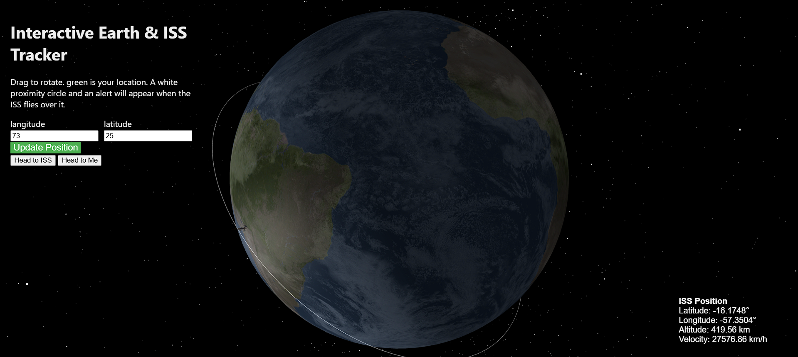
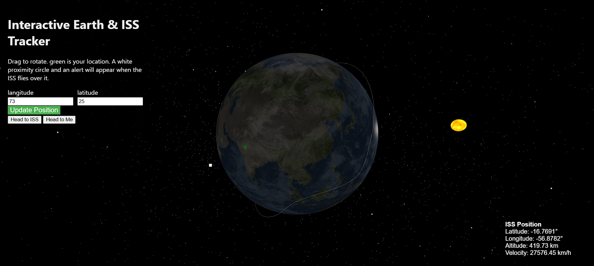
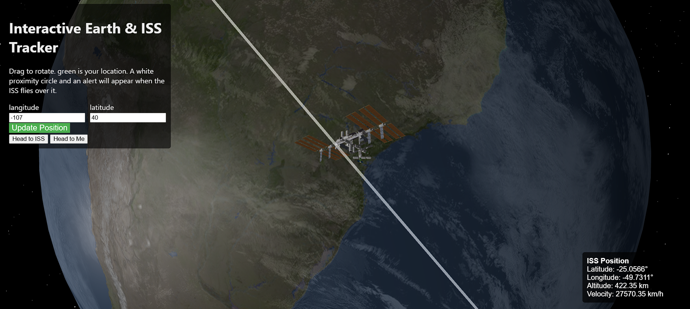

## Inspiration
This is my first Devpost hackathon project. I wanted to build something visually impressive and meaningful related to space, so I chose to track the ISS in real time and display it on a 3D globe.

## What it does
The project tracks the International Space Station’s real-time position and displays it on an interactive 3D globe using Three.js. It includes additional features like user location tracking and proximity alerts when the ISS nears our

## How we built it
Built with HTML, CSS, and JavaScript, the core visualization leverages Three.js for rendering the 3D Earth and satellite movement smoothly and accurately.

## Challenges we ran into
Setting up realistic and performant lighting for the globe was difficult. Balancing visual quality with rendering performance required multiple iterations and optimizations.

## Accomplishments that we're proud of
We created a smooth, visually appealing globe visualization that updates in real time. The alert system for notifying users when the ISS is nearby adds useful interactivity.

## What we learned
Deepened understanding of Three.js fundamentals, especially geometry, materials, and camera controls. Gained practical experience implementing class-based JavaScript for modular code structure.

## What's next for I3Steller
Planning to expand with more Three.js projects incorporating AI agents for dynamic space visualizations, allowing users to customize parameters like speed and scale through natural language prompts.

# Gallery

